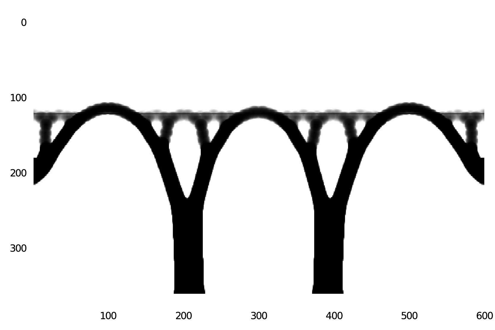

TopOpt in Julia
===

This is an implementation in the Julia programming language of the algorithms presented in Sigmund (2001) and Andreassen (2010).

Since I implemented it mostly to learn Julia, the code has been restructured in order to use Julia concepts, e.g. multiple-dispatch and data types.
Some functions were defined to more easily apply loads and constraints to different parts of the problem.
These are defined in `utils.jl`.

An optimization problem can be run as follows:

```julia
include("topOpt_88.jl")
using .TopOpt88

nx = 100;
ny = 120;
volfrac = 0.15;
p = 3.0;
r_min = nx * 0.03;

prob = TopOptProblemConv(nx, ny, r_min, volfrac, p)
line_load!(prob, ny ÷ 3)
fix_dof!(prob, :bottom)
fix_dof!(prob, :right)
symmetry_axis!(prob, :left)
use_elements!(prob, :hline; y=ny ÷ 3)

@time res = minimize(prob, Δ=0.01, filter=2);
```



## References

- *Sigmund, O.* (2001), _A 99 line topology optimization code written in Matlab_
- *Andreassen, Erik; Clausen, Anders; Schevenels, Mattias; Lazarov, Boyan S.; Sigmund, Ole* (2010), _Efficient topology optimization in MATLAB using 88 lines of code_
